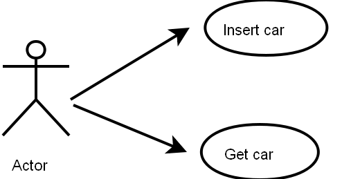
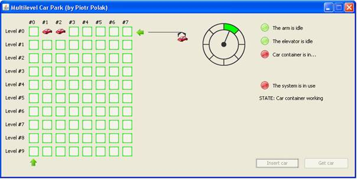
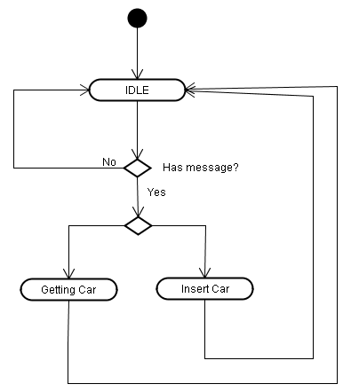
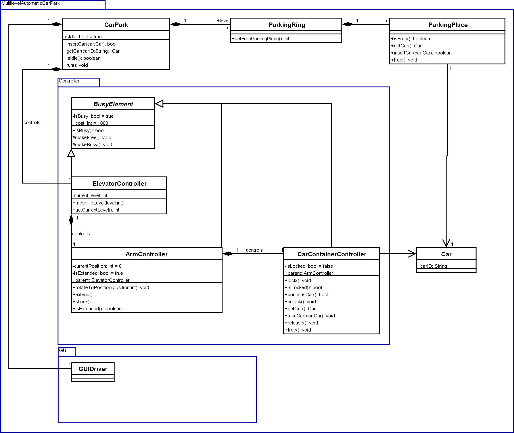
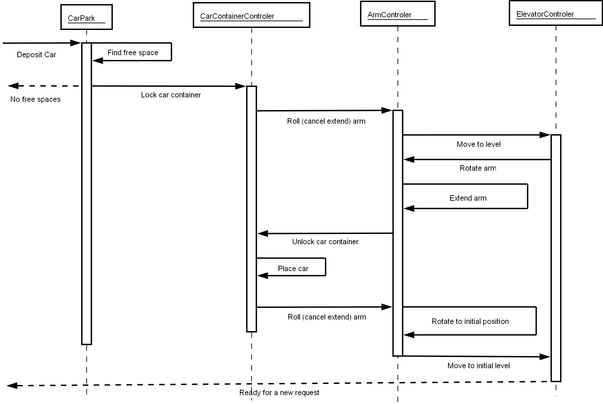

Multilevel Automatic Car Park 
=============================

A project written in JavaSE for Embeded Software course, a software implementation of a multilevel automatic car parking system (controllers + visualization).

This project is just a simulation and has not been implemented "in real life".

Description
-----------

The car park consists of a number of parking rings, each of a certain number of parking places.

In the center of all the rings there is an elevator having an arm. The lift can move on the vertical axis only while the arm can only rotate around the lift axis.

A car container is placed at the end of the container arm. Its aim it is to keep the car within it while transporting it to the desired place. The container can open/close only if the container arm is in the extended state.

A single place on the 0 level is reserved for so called "get/insert car gate". The user places his car in the gate and the car is placed in the first free parking place. The user can further request his car, the car will be brought to the same gate.

Use cases
---------

Controllers
-----------

There are 3 types of dependent controllers:

* ElevatorController
* ArmController
* CarContainerController

All the actions of the controllers must be done in a sequence of commands, the order of commands is strictly specified by controllers dependencies.

Only one controller can work at the moment meaning:

* The ArmController may operate only when the parent controller ElevatorController is IDLE,
* CarContainerController can only extend or shrink when the ArmController is IDLE. It cannot open when the ArmController is shrink,
* In the case the program tries to perform an illegal operation, the system throws an IllegalOperationException and locks (waits for the lift operator).

Code
----

The code of the application is split into 4 packages:

* Controllers – a package for controllers and super class BusyElement
* Exception – a package for application specific exceptions
* Generic – a package for the CarPark structure and generic classes
* GUI – a package containing all the GUI components and GUIDriver

GUIDriver is an interface providing a simple communication between the SYSTEM (controllers) and GUI in a uniform way independent on the presentation layer chosen. In my project I have chosen a standard SWING windows and some PNG graphics.

GUI is implemented as a parallel thread so that when a controller locks, the GUI still shows the current state of the SYSTEM.

The reverse communication between the GUI and the SYSTEM is done trough so called "messager". When there is a GUI action that must be passed to the controller (for example inserting or getting the car), GUI sends a "message" that is "caught" by the IDLE process (stepping loop) of the CarPark thread (see run() method of the CarPark).

Each controller extends the BusyElement class which is responsible for controller state notification and delays (only for simulation). Each controller separately specifies the cost of a move (in milliseconds).

GUI
---

GUI consists of the map of places, arrow indicators showing the current level of the elevator and the current position of the arm, round indicators (arm, elevator, car container, system), arm state and car container state indicators. The big round indicator shows the current position of the arm in the cross section of the car park.

When a car is inserted a sequence of actions is performed inside the controllers, controllers communicate with the GUI trough the GUI driver changing the objects.

The icon of the car on the places map indicates that a certain place is occupied.

The green square shows that the place is free.

There are two buttons in the right lower corner, this is the end user interface. When a user presses a button, he is asked to introduce the car plates number (this would be normally done trough an optical device), then according to state of the parking and the message given by the controllers (exceptions), his car is taken by the CarContainer and placed at the nearest park place or rejected.

The buttons are active only if the system is IDLE.

Diagrams
--------

The following diagram shows how the main controller gets the actions from the GUI trough the GUI messenger.

### Activity diagram

### Class diagram

### Sequence diagram for inserting a new car

